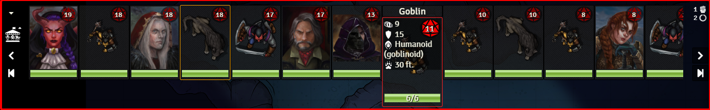
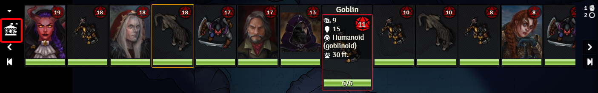
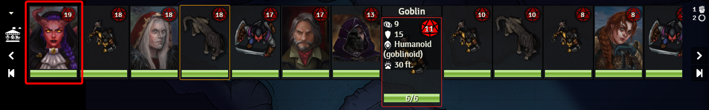
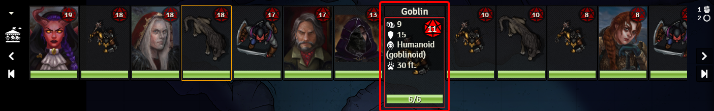
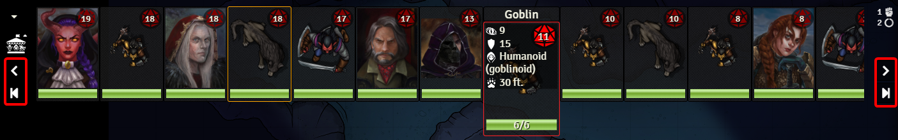
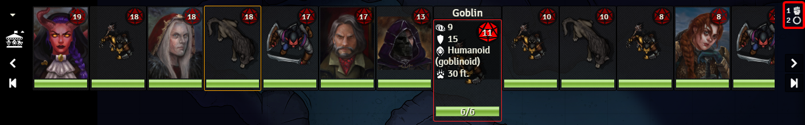
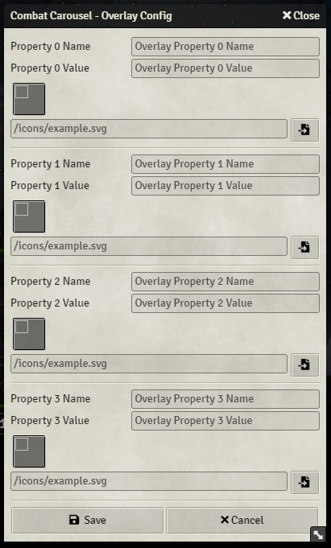

    
*It's free to ride, but it might cost your life...*

A Foundry VTT module to display CRPG-style Combatant cards in carousel-like format.

# Using the Module
The module is broken up into a number of components that reimagine the Foundry VTT Combat Tracker. Here's a brief description of each of them and their function, with a deeper dive available further down.

The first of these is the [Carousel](#Carousel). This is the main component and the heart of Combat Carousel. The **Carousel** contains the **Combatant Cards** and **Combat Controls**.    
    

When you start out your **Carousel** will probably be collapsed and empty as shown below, unless you have an active combat `encounter` when you load the module.    

The **multi-state icon** shows you the state of your **Combat Carousel**. The different states are outlined in [Multi State Icon](#Multi-State-Icon).    

Each Combatant is represented by a [Combatant Card](#Combatant-Card). By default **Combatant Cards** show the Combatant's **Actor Portrait/Token Image**, **Initiative**, and **Health Bar**.    
    

A `hovered` **Combatant Card** shows additional information: the **Token/Actor Name**, **Health Value**, any active **Combat Badges**, and the **Property Overlay** (if configured)    
    

You can control the flow of Combat using the **Combat Controls**. These controls allow you to move forwards and backwards through `turns` and `rounds`.    
    

The current `encounter` and `round` are shown in the **Encounter Info Overlay**    
    

Finally, you can set your desired [Overlay Properties](#Overlay-Properties) in the config, which is accessed by right-clicking the **multi-state icon**. Each **Property Overlay** can be configured with a **Name**, **Value**, and an **Icon**. Only properties with a **Value** will be displayed on the **Combatant Card**    
    

That's it! If you want to dive deeper into the various components, check out the sections below.

## Carousel
### Interactions
- Click the **Combat Control** buttons to move forwards/backwards through the turn or round order

## Combatant Card
### Components
- Actor Portrait/Token Image
- Initiative
- Combat Tracker Indicators
- Health Bar

### Hovered Components
- Property Overlay
- Name
- Health Value

### Interactions
- Click to set as the active turn
- Double-click to open Actor sheet
- Hover to see more info and highlight the token on the scene and in the native combat tracker

### Other Interactions
- Hover over a token on the canvas to highlight the related combatant card (if any)
- Hover over a combatant in the native combat tracker to highlight the related combatant card (if any)

### Combatant Name
#### Interactions
- Hover to see **Combatant Controls**
- - Mark Defeated -- Mark this Combatant defeated
- - Toggle Visibility -- Toggle non-owner visibility of this Combatant
- - Remove -- remove this Combatant from the encounter

## Multi-State Icon
### States
 Grey Empty Carousel - no combat    
 White empty carousel - active combat with no combatants    
 White full carousel - active combat with combatants    

### Interactions
- Click to toggle **Carousel** visibility
- Right-click to open the **Overlay Properties** config

## Property Overlay Config
### Usage
Each **Property Overlay** can be configured with a **Name**, **Value**, and **Icon** using the form fields

### Name
Enter a name to be displayed in the **Icon** tooltip

### Value
Enter a `dot separated` line of text that refers to an `Actor.data` property.    
An example (from the dnd5e system): `data.attributes.ac.value`

### Icon
Enter a path to an icon to represent the **Property** or use the `filepicker` button to select one

## Attribution
- This module uses the SplideJS library to provide carousel functionality: https://splidejs.com/
- Carousel icon based on `Horse Carousel` icon by <a href="https://www.flaticon.com/authors/freepik" title="Freepik">Freepik</a> from https://www.flaticon.com/free-icon/horse-carousel_82324
- - `goblin-face`, `spiked-dragon`, `cowled` icons from https://game-icons.net
- "Combat Carousel" textmark uses the following fonts: 
- - `Capture It` by Magique Fonts https://www.dafont.com/capture-it.font 
- - `Budmo Jiggler` by Typodermic Fonts https://www.dafont.com/budmo.font?text=budmo